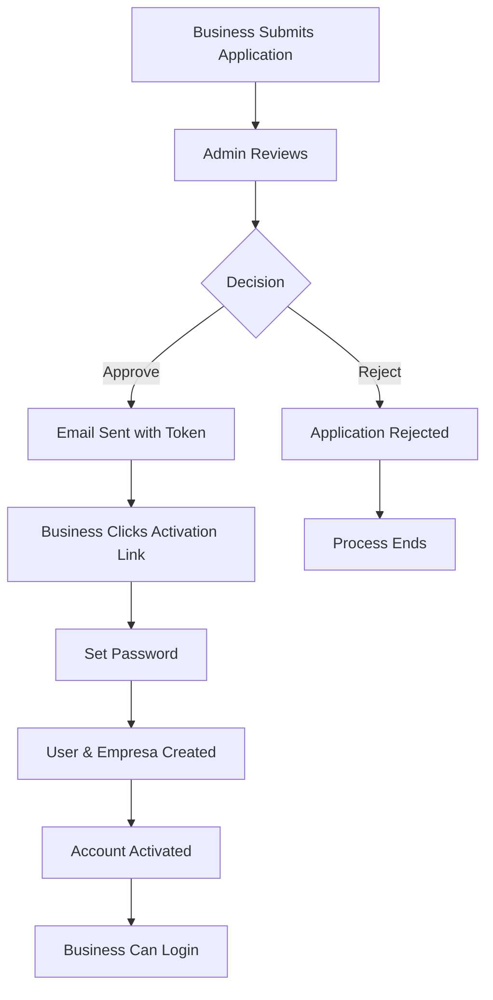

The business onboarding workflow in BeanQuick is a multi-step process that ensures only verified businesses can sell on the platform. This guide walks through each stage from initial application to active seller status.

## Workflow Overview



<Info>
  The workflow involves **three main parties**: the business applicant, the admin, and the system's automated processes.
</Info>

---

## Step 1: Business Registration Request

Businesses begin by submitting an application through the public registration form.

### Application Data

```php SolicitudEmpresa.php:14-25
protected $fillable = [
    'nombre',
    'correo',
    'nit',
    'telefono',
    'direccion',
    'descripcion',
    'logo',
    'foto_local',
    'estado',    // 'pendiente', 'aprobado', 'rechazado'
    'token',     // Token de seguridad para la activación
];
```

### Submission Process

<Steps>
  <Step title="Fill Application Form">
    Business provides:
    - Company name and contact email
    - NIT (tax ID), phone, and address
    - Business description
    - Logo image (max 2MB: jpeg, png, jpg, webp)
    - Storefront photo (max 4MB: jpeg, png, jpg, webp)
  </Step>
  
  <Step title="Upload Images">
    Images are stored temporarily in the `solicitudes/` directory:
    - Logo: `storage/solicitudes/logos/`
    - Storefront: `storage/solicitudes/locales/`
  </Step>
  
  <Step title="Submit to API">
    ```bash
    POST /api/solicitud-empresa
    Content-Type: multipart/form-data
    ```
  </Step>
  
  <Step title="Record Created">
    A `SolicitudEmpresa` record is created with status `pendiente`
  </Step>
</Steps>

### API Response

```json
{
  "status": "success",
  "message": "Tu solicitud fue enviada correctamente. Nuestro equipo la revisará pronto.",
  "solicitud_id": 1
}
```

<Note>
  At this stage, no user account is created yet. The application waits for admin review.
</Note>

---

## Step 2: Admin Review

Administrators review pending applications from their dashboard.

### Viewing Pending Applications

```bash
GET /api/admin/solicitudes
```

Returns all applications with `estado = 'pendiente'`:

```php AdminController.php:34
'solicitudes' => SolicitudEmpresa::where('estado', 'pendiente')->get(),
```

### Admin Decision Points

<Tabs>
  <Tab title="Approve">
    **Action**: `POST /api/admin/aprobar/{id}`
    
    When approved:
    1. Generate a secure 60-character token
    2. Update application status to `aprobado`
    3. Store the token in the database
    4. Send activation email to the business

    ```php AdminController.php:43-54
    public function aprobar($id): JsonResponse
    {
        $solicitud = SolicitudEmpresa::findOrFail($id);
        $token = Str::random(60);
        
        $solicitud->update([
            'estado' => 'aprobado',
            'token'  => $token 
        ]);
        
        $link = "http://localhost:5173/empresa/activar/" . $token;
        Mail::to($solicitud->correo)->send(new ActivacionEmpresaMail($solicitud, $link));
        // ...
    }
    ```

    <Check>
      The business receives an email with a unique activation link valid for their application.
    </Check>
  </Tab>
  
  <Tab title="Reject">
    **Action**: `POST /api/admin/rechazar/{id}`
    
    When rejected:
    1. Update application status to `rechazado`
    2. Application is removed from pending queue
    3. No email is sent (optional: could notify rejection)

    ```php AdminController.php:80-89
    public function rechazar($id): JsonResponse
    {
        $solicitud = SolicitudEmpresa::findOrFail($id);
        $solicitud->estado = 'rechazado';
        $solicitud->save();
        
        return response()->json([
            'message' => 'Solicitud rechazada.',
            'solicitud' => $solicitud
        ]);
    }
    ```

    <Warning>
      Rejected applications remain in the database but won't be processed further.
    </Warning>
  </Tab>
</Tabs>

---

## Step 3: Email Activation

Approved businesses receive an activation email with a unique link.

### Email Contents

- **Subject**: Account approval notification
- **Body**: Welcome message and activation instructions
- **Link**: `http://localhost:5173/empresa/activar/{token}`

<Info>
  The token in the URL is a 60-character random string that serves as a one-time activation key.
</Info>

### Token Validation

When the business clicks the link:

```bash
GET /api/empresa/validar-token/{token}
```

```php EmpresaActivacionController.php:20-35
public function validarToken($token): JsonResponse
{
    $solicitud = SolicitudEmpresa::where('token', $token)
        ->where('estado', 'aprobado')
        ->first();

    if (!$solicitud) {
        return response()->json([
            'message' => 'El enlace de activación no es válido o ya fue usado.'
        ], 404);
    }

    return response()->json([
        'status' => 'success',
        'solicitud' => $solicitud
    ]);
}
```

<Check>
  If valid, the frontend displays the activation form pre-filled with business details.
</Check>

---

## Step 4: Account Activation

The business completes activation by setting their password.

### Activation Process

<Steps>
  <Step title="Password Setup">
    Business enters and confirms their password (minimum 8 characters)
  </Step>
  
  <Step title="Submit Activation">
    ```bash
    POST /api/empresa/activar/{token}
    {
      "password": "securepassword123",
      "password_confirmation": "securepassword123"
    }
    ```
  </Step>
  
  <Step title="Database Transaction">
    The system performs several operations atomically:
    
    **a) Create User Account**
    ```php EmpresaActivacionController.php:64-70
    $user = User::create([
        'name' => $solicitud->nombre,
        'email' => $solicitud->correo,
        'password' => Hash::make($request->password),
        'rol' => 'empresa',
    ]);
    ```
    
    **b) Move Images to Permanent Storage**
    - Logo: `solicitudes/logos/` → `empresas/logos/`
    - Photo: `solicitudes/locales/` → `empresas/locales/`
    
    **c) Create Empresa Record**
    ```php EmpresaActivacionController.php:108-109
    $empresa = Empresa::create($empresaData);
    ```
    
    **d) Update Application Status**
    ```php EmpresaActivacionController.php:112-115
    $solicitud->update([
        'estado' => 'completada',
        'token' => null,  // Invalidate token
    ]);
    ```
    
    **e) Clean Up Temporary Files**
    ```php EmpresaActivacionController.php:118-119
    if ($solicitud->logo) Storage::disk('public')->delete($solicitud->logo);
    if ($solicitud->foto_local) Storage::disk('public')->delete($solicitud->foto_local);
    ```
  </Step>
  
  <Step title="Account Created">
    Business receives confirmation and can now log in
  </Step>
</Steps>

### Success Response

```json
{
  "status": "success",
  "message": "Cuenta creada exitosamente. Ya puedes iniciar sesión.",
  "user": {
    "id": 5,
    "name": "Café Delicioso",
    "email": "cafe@example.com",
    "rol": "empresa"
  }
}
```

<Check>
  The business is now fully registered and can log in using their email and password.
</Check>

---

## Application States

The `estado` field tracks the application's progress:

<AccordionGroup>
  <Accordion title="pendiente" icon="clock">
    **Initial state** after form submission
    - Application awaits admin review
    - Visible in admin dashboard
    - No user account exists yet
  </Accordion>
  
  <Accordion title="aprobado" icon="check">
    **After admin approval**
    - Activation email sent
    - Token generated and stored
    - Awaiting business activation
  </Accordion>
  
  <Accordion title="rechazado" icon="xmark">
    **After admin rejection**
    - Application denied
    - No further action taken
    - Record kept for audit purposes
  </Accordion>
  
  <Accordion title="completada" icon="circle-check">
    **After successful activation**
    - User and Empresa records created
    - Token invalidated (set to null)
    - Images moved to permanent storage
    - Business can now log in
  </Accordion>
</AccordionGroup>

---

## Post-Activation: Business Setup

Once activated, businesses gain access to their dashboard and can:

<CardGroup cols={2}>
  <Card title="Update Profile" icon="pen-to-square">
    Modify business information, logo, and photos via:
    ```bash
    POST /api/empresa/update
    ```
  </Card>
  
  <Card title="Add Products" icon="box">
    Create their product catalog:
    ```bash
    POST /api/empresa/productos
    ```
  </Card>
  
  <Card title="Set Availability" icon="toggle-on">
    Toggle open/closed status:
    ```bash
    POST /api/empresa/toggle-estado
    ```
  </Card>
  
  <Card title="Receive Orders" icon="bell">
    View and fulfill customer orders:
    ```bash
    GET /api/empresa/pedidos
    ```
  </Card>
</CardGroup>

---

## Key Relationships

### User ↔ Empresa

Each business has one user account and one empresa profile:

```php User.php:29-32
public function empresa()
{
    return $this->hasOne(Empresa::class, 'user_id');
}
```

```php Empresa.php:47-50
public function usuario()
{
    return $this->belongsTo(User::class, 'user_id');
}
```

### Database Schema

```
users
  ├── id (PK)
  ├── name
  ├── email
  ├── password
  └── rol = 'empresa'

empresas
  ├── id (PK)
  ├── user_id (FK → users.id)
  ├── nombre
  ├── nit
  ├── direccion
  ├── telefono
  ├── descripcion
  ├── logo
  ├── foto_local
  └── is_open

solicitudes_empresas
  ├── id (PK)
  ├── nombre
  ├── correo
  ├── nit
  ├── estado ('pendiente', 'aprobado', 'rechazado', 'completada')
  └── token (nullable)
```

---

## Error Handling

<Warning>
  Common issues and their solutions:
</Warning>

### Invalid Token

**Problem**: Token doesn't exist or was already used

```json
{
  "message": "El enlace de activación no es válido o ya fue usado."
}
```

**Solution**: Business must request a new approval from admin

---

### Duplicate Email

**Problem**: Email already registered in `users` table

```json
{
  "message": "Ya existe una cuenta con este correo."
}
```

**Solution**: Use different email or contact admin to resolve

---

### Email Delivery Failure

**Problem**: Mail server error during approval

```php AdminController.php:67-73
catch (\Exception $e) {
    return response()->json([
        'message' => 'Solicitud aprobada pero hubo un error al enviar el correo.',
        'error'   => $e->getMessage()
    ], 500);
}
```

**Solution**: Application is still approved; admin can manually send activation link

---

## Security Considerations

<Card title="Security Features" icon="shield">
  - **One-time tokens**: 60-character random strings, invalidated after use
  - **Email verification**: Ensures applicant owns the email address
  - **Admin approval**: Prevents automated spam registrations
  - **Password hashing**: Passwords stored using bcrypt
  - **Transaction safety**: Database rollback on any activation failure
</Card>

---

## Workflow Diagram with Code References

```
┌─────────────────────────────────────────────────────────────┐
│ 1. REGISTRATION                                             │
│    POST /api/solicitud-empresa                              │
│    → SolicitudEmpresaController::store()                    │
│    → Creates record with estado='pendiente'                 │
└─────────────────────────────────────────────────────────────┘
                           |
                           v
┌─────────────────────────────────────────────────────────────┐
│ 2. ADMIN REVIEW                                             │
│    GET /api/admin/solicitudes                               │
│    → AdminController::dashboard()                           │
│                                                             │
│    APPROVE: POST /api/admin/aprobar/{id}                    │
│    → Generate token, send email, estado='aprobado'          │
│                                                             │
│    REJECT: POST /api/admin/rechazar/{id}                    │
│    → Set estado='rechazado', end process                    │
└─────────────────────────────────────────────────────────────┘
                           |
                           v
┌─────────────────────────────────────────────────────────────┐
│ 3. EMAIL & VALIDATION                                       │
│    GET /api/empresa/validar-token/{token}                   │
│    → EmpresaActivacionController::validarToken()            │
│    → Verifies token exists and estado='aprobado'            │
└─────────────────────────────────────────────────────────────┘
                           |
                           v
┌─────────────────────────────────────────────────────────────┐
│ 4. ACTIVATION                                               │
│    POST /api/empresa/activar/{token}                        │
│    → EmpresaActivacionController::store()                   │
│    → Creates User (rol='empresa')                           │
│    → Creates Empresa                                        │
│    → Moves images to permanent storage                      │
│    → Updates estado='completada', nullifies token           │
└─────────────────────────────────────────────────────────────┘
                           |
                           v
┌─────────────────────────────────────────────────────────────┐
│ 5. ACTIVE BUSINESS                                          │
│    POST /api/login                                          │
│    → Business can now authenticate and access dashboard     │
└─────────────────────────────────────────────────────────────┘
```

---

## Testing the Workflow

<Steps>
  <Step title="Submit Application">
    ```bash
    curl -X POST http://localhost:8000/api/solicitud-empresa \
      -F "nombre=Mi Cafetería" \
      -F "correo=cafe@test.com" \
      -F "nit=123456789" \
      -F "logo=@logo.png" \
      -F "foto_local=@storefront.jpg"
    ```
  </Step>
  
  <Step title="Admin Approves">
    ```bash
    curl -X POST http://localhost:8000/api/admin/aprobar/1 \
      -H "Authorization: Bearer {admin_token}"
    ```
  </Step>
  
  <Step title="Validate Token">
    ```bash
    curl http://localhost:8000/api/empresa/validar-token/{token}
    ```
  </Step>
  
  <Step title="Activate Account">
    ```bash
    curl -X POST http://localhost:8000/api/empresa/activar/{token} \
      -H "Content-Type: application/json" \
      -d '{
        "password": "SecurePass123",
        "password_confirmation": "SecurePass123"
      }'
    ```
  </Step>
  
  <Step title="Login as Business">
    ```bash
    curl -X POST http://localhost:8000/api/login \
      -H "Content-Type: application/json" \
      -d '{
        "email": "cafe@test.com",
        "password": "SecurePass123"
      }'
    ```
  </Step>
</Steps>

---

## Next Steps

<CardGroup cols={2}>
  <Card title="User Roles" icon="users" href="/concepts/user-roles">
    Learn about business permissions and capabilities
  </Card>
  <Card title="Order Lifecycle" icon="arrows-spin" href="/concepts/order-lifecycle">
    Understand how businesses fulfill customer orders
  </Card>
</CardGroup>