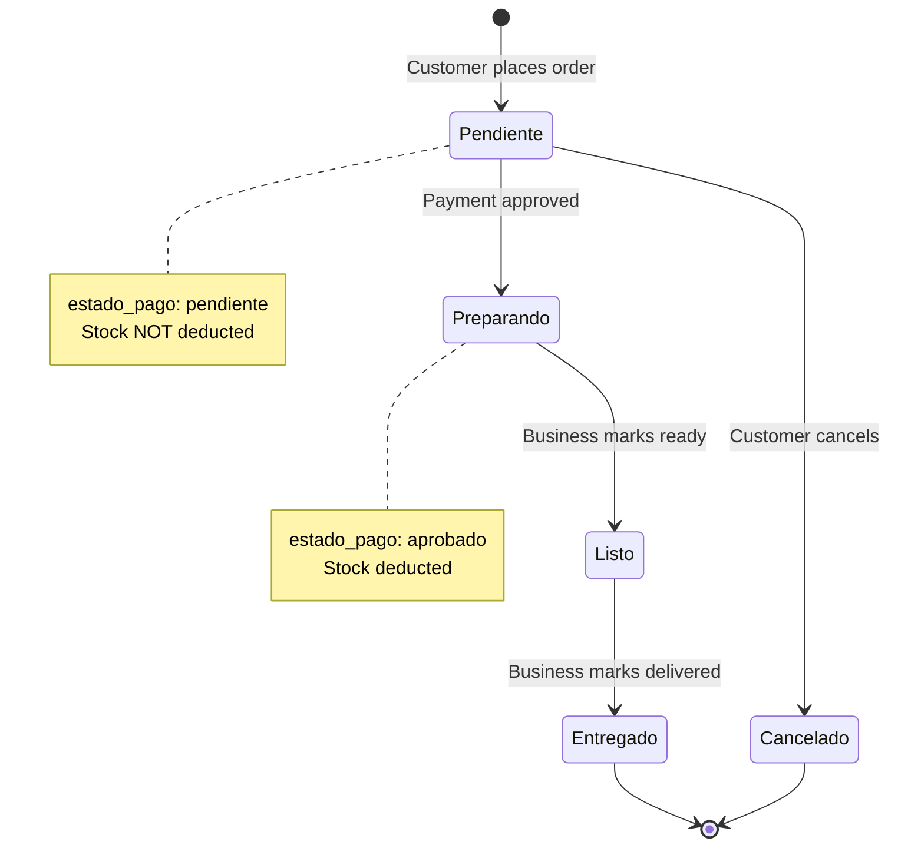

Orders in BeanQuick follow a structured lifecycle with distinct states for both order fulfillment and payment processing. This guide explains each state, transitions, and the actors involved.

## Lifecycle Overview



<Info>
  BeanQuick uses **two separate status fields**: `estado` for order fulfillment and `estado_pago` for payment status.
</Info>

---

## Order States (`estado`)

The `estado` field tracks the order's fulfillment progress:

```php Pedido.php:15-16
'estado',       // 'pendiente', 'pagado', 'preparando', 'listo', 'entregado', 'cancelado'
'estado_pago',  // 'pendiente', 'aprobado', 'rechazado'
```

<AccordionGroup>
  <Accordion title="Pendiente" icon="clock" defaultOpen>
    **Initial state** when order is created
    
    **Characteristics:**
    - Order exists in database but not confirmed
    - Payment status: `pendiente`
    - Stock is **NOT** deducted yet
    - Customer can still cancel
    - Business **cannot** see this order yet
    
    **Created by:**
    ```php PedidoController.php:97-105
    $pedido = Pedido::create([
        'empresa_id'    => $request->empresa_id,
        'user_id'       => $user->id,
        'estado'        => 'Pendiente',
        'hora_recogida' => $request->hora_recogida,
        'total'         => $total,
        'estado_pago'   => 'pendiente'
    ]);
    ```
    
    <Warning>
      Stock validation occurs at this stage, but stock is NOT deducted until payment is approved.
    </Warning>
  </Accordion>
  
  <Accordion title="Preparando" icon="kitchen-set">
    **Active preparation** by business
    
    **Characteristics:**
    - Payment approved (`estado_pago = 'aprobado'`)
    - Stock has been deducted
    - Order appears in business dashboard
    - Business is preparing the products
    - Customer cannot cancel (must contact business)
    
    **Transition:**
    Automatically moves from `Pendiente` to `Preparando` when payment is approved via Mercado Pago webhook.
    
    **Business sees:**
    ```php PedidoController.php:153-157
    $pedidos = Pedido::where('empresa_id', $empresa->id)
        ->where('estado_pago', 'aprobado')
        ->with(['productos', 'cliente'])
        ->get();
    ```
  </Accordion>
  
  <Accordion title="Listo" icon="box-check">
    **Ready for pickup**
    
    **Characteristics:**
    - Order is prepared and waiting for customer
    - Customer should arrive at scheduled pickup time
    - Business notifies customer (via frontend UI)
    
    **Updated by business:**
    ```bash
    PATCH /api/empresa/pedidos/{id}/estado
    { "estado": "Listo" }
    ```
    
    <Check>
      This is the customer's signal that their order is ready to collect.
    </Check>
  </Accordion>
  
  <Accordion title="Entregado" icon="circle-check">
    **Order completed**
    
    **Characteristics:**
    - Customer received their order
    - Transaction complete
    - Customer can now review products
    - Final state (terminal)
    
    **Updated by business:**
    ```bash
    PATCH /api/empresa/pedidos/{id}/estado
    { "estado": "Entregado" }
    ```
    
    <Info>
      Once delivered, the order cannot be modified further.
    </Info>
  </Accordion>
  
  <Accordion title="Cancelado" icon="xmark">
    **Order cancelled**
    
    **Characteristics:**
    - Order will not be fulfilled
    - If payment was approved, stock is returned
    - Payment status changes to `rechazado`
    - Terminal state
    
    **Can be cancelled by:**
    - **Customer** (only if `estado = 'Pendiente'`)
    - **Business** (at any time via status update)
    
    **Cancellation logic:**
    ```php PedidoController.php:179-192
    \DB::transaction(function () use ($pedido) {
        // Only return stock if payment was approved
        if ($pedido->estado_pago === 'aprobado') {
            foreach ($pedido->productos as $producto) {
                $producto->increment('stock', $producto->pivot->cantidad);
            }
        }
        
        $pedido->update([
            'estado' => 'Cancelado',
            'estado_pago' => 'rechazado'
        ]);
    });
    ```
  </Accordion>
</AccordionGroup>

---

## Payment States (`estado_pago`)

Payment status is managed separately via Mercado Pago integration:

<Tabs>
  <Tab title="pendiente">
    **Awaiting payment**
    
    - Order created but not yet paid
    - Customer must complete payment
    - Stock is validated but NOT deducted
    - Order not visible to business yet
    
    **Payment initiated:**
    ```bash
    POST /api/cliente/pedidos/{id}/pagar
    ```
    
    This creates a Mercado Pago preference and returns a payment link.
  </Tab>
  
  <Tab title="aprobado">
    **Payment successful**
    
    - Payment confirmed by Mercado Pago
    - Stock is deducted from inventory
    - Order status advances to `Preparando`
    - Business can now see and fulfill order
    
    **Updated via webhook:**
    ```bash
    POST /api/webhook/mercadopago
    ```
    
    <Check>
      The webhook automatically processes payment confirmations and updates order status.
    </Check>
  </Tab>
  
  <Tab title="rechazado">
    **Payment failed or cancelled**
    
    - Payment declined or order cancelled
    - Stock returned if it was deducted
    - Order marked as `Cancelado`
    
    <Warning>
      This is a terminal state. Customer must create a new order to try again.
    </Warning>
  </Tab>
</Tabs>

---

## Order Creation Flow

<Steps>
  <Step title="Customer Adds to Cart">
    Products from a single business are added to cart:
    ```bash
    POST /api/cliente/carrito/agregar/{productoId}
    { "cantidad": 2 }
    ```
  </Step>
  
  <Step title="Create Order">
    Customer proceeds to checkout:
    ```bash
    POST /api/cliente/pedidos
    {
      "empresa_id": 1,
      "hora_recogida": "15:30"
    }
    ```
    
    **System validates:**
    - Cart is not empty
    - All products belong to specified business
    - Stock is sufficient for each product
    - No duplicate pending orders exist
  </Step>
  
  <Step title="Prevent Duplicates">
    ```php PedidoController.php:39-49
    $pedidoExistente = Pedido::where('user_id', $user->id)
        ->where('estado', 'Pendiente')
        ->where('estado_pago', 'pendiente')
        ->first();
    
    if ($pedidoExistente) {
        return response()->json([
            'message' => 'Ya tienes un pedido pendiente de pago.'
        ], 200);
    }
    ```
    
    <Info>
      Customers can only have one pending unpaid order at a time.
    </Info>
  </Step>
  
  <Step title="Stock Validation">
    ```php PedidoController.php:77-85
    foreach ($productosTienda as $producto) {
        $cantidadPedida = $producto->pivot->cantidad ?? 1;
        
        if ($producto->stock < $cantidadPedida) {
            return response()->json([
                'message' => "Stock insuficiente para: {$producto->nombre}"
            ], 422);
        }
    }
    ```
    
    <Warning>
      If any product is out of stock, the entire order is rejected.
    </Warning>
  </Step>
  
  <Step title="Calculate Total">
    ```php PedidoController.php:88-94
    $total = 0;
    foreach ($productosTienda as $producto) {
        $cantidad = $producto->pivot->cantidad ?? 1;
        $precio   = $producto->precio ?? 0;
        $total   += $precio * $cantidad;
    }
    ```
  </Step>
  
  <Step title="Create Order Record">
    Order created with `estado = 'Pendiente'` and `estado_pago = 'pendiente'`
    
    Products are linked via `pedido_productos` pivot table with snapshot of price:
    ```php PedidoController.php:110-116
    PedidoProducto::create([
        'pedido_id'       => $pedido->id,
        'producto_id'     => $producto->id,
        'cantidad'        => $producto->pivot->cantidad ?? 1,
        'precio_unitario' => $producto->precio ?? 0,
    ]);
    ```
    
    <Note>
      Prices are stored at order time to preserve historical accuracy even if product prices change later.
    </Note>
  </Step>
  
  <Step title="Return Order">
    ```json
    {
      "message": "Pedido generado pendiente de pago.",
      "pedido": {
        "id": 42,
        "empresa_id": 1,
        "user_id": 5,
        "estado": "Pendiente",
        "estado_pago": "pendiente",
        "hora_recogida": "15:30",
        "total": 45.50,
        "productos": [...]
      }
    }
    ```
  </Step>
</Steps>

---

## Payment Processing Flow

<Steps>
  <Step title="Initiate Payment">
    Customer clicks "Pay" on their pending order:
    ```bash
    POST /api/cliente/pedidos/{id}/pagar
    ```
    
    This generates a Mercado Pago payment link and returns it to the frontend.
  </Step>
  
  <Step title="Customer Pays">
    Customer is redirected to Mercado Pago to complete payment using:
    - Credit/debit card
    - Cash payment locations
    - Bank transfer
    - Other payment methods
  </Step>
  
  <Step title="Webhook Notification">
    Mercado Pago sends payment confirmation:
    ```bash
    POST /api/webhook/mercadopago
    {
      "type": "payment",
      "data": { "id": "payment_id" }
    }
    ```
    
    The `PagoController` processes this and:
    1. Verifies payment status
    2. Updates `estado_pago = 'aprobado'`
    3. Changes `estado` to `Preparando`
    4. **Deducts stock** from products
  </Step>
  
  <Step title="Order Activated">
    Order now appears in business dashboard for fulfillment
  </Step>
</Steps>

<Warning>
  **Critical**: Stock is only deducted AFTER payment approval, not at order creation. This prevents stock being locked by unpaid orders.
</Warning>

---

## Business Fulfillment Flow

<Steps>
  <Step title="View Orders">
    Business checks incoming orders:
    ```bash
    GET /api/empresa/pedidos
    ```
    
    Only shows orders where `estado_pago = 'aprobado'`:
    ```php PedidoController.php:153-157
    $pedidos = Pedido::where('empresa_id', $empresa->id)
        ->where('estado_pago', 'aprobado')
        ->with(['productos', 'cliente'])
        ->orderBy('created_at', 'asc')
        ->get();
    ```
  </Step>
  
  <Step title="Prepare Order">
    Order status is `Preparando` - business prepares items
  </Step>
  
  <Step title="Mark as Ready">
    When order is ready for pickup:
    ```bash
    PATCH /api/empresa/pedidos/{id}/estado
    { "estado": "Listo" }
    ```
  </Step>
  
  <Step title="Customer Picks Up">
    Customer arrives at scheduled time (`hora_recogida`)
  </Step>
  
  <Step title="Mark as Delivered">
    After handing over order:
    ```bash
    PATCH /api/empresa/pedidos/{id}/estado
    { "estado": "Entregado" }
    ```
    
    <Check>
      Order is now complete and customer can leave a review.
    </Check>
  </Step>
</Steps>

### Status Update Validation

```php PedidoController.php:213-217
if ($pedido->estado_pago !== 'aprobado') {
    return response()->json([
        'message' => 'No puedes modificar un pedido que no ha sido pagado.'
    ], 400);
}
```

<Warning>
  Businesses cannot update order status unless payment is approved.
</Warning>

---

## Customer Cancellation Flow

Customers can cancel orders under specific conditions:

<Steps>
  <Step title="Customer Requests Cancellation">
    ```bash
    POST /api/cliente/pedidos/{id}/cancelar
    ```
  </Step>
  
  <Step title="Validate Cancellation">
    ```php PedidoController.php:175-177
    if (strtolower($pedido->estado) !== 'pendiente') {
        return response()->json([
            'message' => 'No puedes cancelar un pedido ' . $pedido->estado
        ], 400);
    }
    ```
    
    <Info>
      Only orders in `Pendiente` state can be cancelled by customers.
    </Info>
  </Step>
  
  <Step title="Return Stock (if applicable)">
    ```php PedidoController.php:182-186
    if ($pedido->estado_pago === 'aprobado') {
        foreach ($pedido->productos as $producto) {
            $producto->increment('stock', $producto->pivot->cantidad);
        }
    }
    ```
    
    Stock is only returned if payment was already approved.
  </Step>
  
  <Step title="Update Order">
    ```php PedidoController.php:188-191
    $pedido->update([
        'estado' => 'Cancelado',
        'estado_pago' => 'rechazado'
    ]);
    ```
  </Step>
</Steps>

---

## State Transition Rules

<Tabs>
  <Tab title="Valid Transitions">
    | From | To | Trigger | Actor |
    |------|----|---------| ----- |
    | Pendiente | Preparando | Payment approved | System (webhook) |
    | Pendiente | Cancelado | Cancellation request | Customer |
    | Preparando | Listo | Marked ready | Business |
    | Preparando | Cancelado | Manual cancel | Business |
    | Listo | Entregado | Marked delivered | Business |
    | Listo | Cancelado | Manual cancel | Business |
  </Tab>
  
  <Tab title="Invalid Transitions">
    **These transitions are blocked:**
    
    - ❌ Pendiente → Listo (must go through Preparando)
    - ❌ Preparando → Pendiente (cannot reverse after payment)
    - ❌ Entregado → any state (terminal state)
    - ❌ Cancelado → any state (terminal state)
    - ❌ Any state change if `estado_pago != 'aprobado'`
    
    <Warning>
      The API will reject invalid state transitions with a 400 error.
    </Warning>
  </Tab>
  
  <Tab title="Allowed Values">
    ```php PedidoController.php:206
    $request->validate([
        'estado' => 'required|in:Preparando,Listo,Entregado,Cancelado'
    ]);
    ```
    
    **Note:** Validation uses capitalized values, but the system normalizes them:
    ```php PedidoController.php:219
    $nuevoEstado = ucfirst(strtolower($request->estado));
    ```
  </Tab>
</Tabs>

---

## Stock Management

### When Stock is Deducted

<Card title="Payment Approval" icon="minus">
  Stock is deducted when payment is confirmed (webhook):
  
  ```php
  // In PagoController::webhook() after payment verification
  foreach ($pedido->productos as $producto) {
      $producto->decrement('stock', $producto->pivot->cantidad);
  }
  
  $pedido->update([
      'estado' => 'Preparando',
      'estado_pago' => 'aprobado'
  ]);
  ```
</Card>

### When Stock is Returned

<Card title="Cancellation" icon="plus">
  Stock is returned when paid orders are cancelled:
  
  ```php PedidoController.php:182-186
  if ($pedido->estado_pago === 'aprobado') {
      foreach ($pedido->productos as $producto) {
          $producto->increment('stock', $producto->pivot->cantidad);
      }
  }
  ```
  
  <Info>
    If order was never paid, stock was never deducted, so nothing needs to be returned.
  </Info>
</Card>

---

## Order Model Structure

```php Pedido.php:12-19
protected $fillable = [
    'user_id',
    'empresa_id',
    'estado',       // 'pendiente', 'pagado', 'preparando', 'listo', 'entregado', 'cancelado'
    'estado_pago',  // 'pendiente', 'aprobado', 'rechazado'
    'hora_recogida',
    'total'
];
```

### Relationships

```php Pedido.php:35-58
// Customer who placed the order
public function cliente()
{
    return $this->belongsTo(User::class, 'user_id');
}

// Business fulfilling the order
public function empresa()
{
    return $this->belongsTo(Empresa::class, 'empresa_id');
}

// Products in the order with pricing snapshot
public function productos()
{
    return $this->belongsToMany(Producto::class, 'pedido_productos')
                ->withPivot('cantidad', 'precio_unitario')
                ->withTimestamps();
}
```

---

## Database Schema

```
pedidos
  ├── id (PK)
  ├── user_id (FK → users.id)
  ├── empresa_id (FK → empresas.id)
  ├── estado ('Pendiente', 'Preparando', 'Listo', 'Entregado', 'Cancelado')
  ├── estado_pago ('pendiente', 'aprobado', 'rechazado')
  ├── hora_recogida (time)
  ├── total (decimal)
  ├── created_at
  └── updated_at

pedido_productos (pivot)
  ├── id (PK)
  ├── pedido_id (FK → pedidos.id)
  ├── producto_id (FK → productos.id)
  ├── cantidad (int)
  ├── precio_unitario (decimal) -- snapshot of price at order time
  ├── created_at
  └── updated_at
```

---

## Complete State Diagram

```
┌─────────────────────────────────────────────────────────────┐
│                     ORDER CREATED                           │
│                  (customer POST /pedidos)                   │
└────────────────────────┬────────────────────────────────────┘
                         │
                         v
              ┌──────────────────┐
              │   PENDIENTE      │ ◄── estado_pago: pendiente
              │                  │     Stock: NOT deducted
              └────┬─────────┬───┘     Visible to: Customer only
                   │         │
        Customer   │         │ Payment approved (webhook)
        cancels    │         │
                   │         v
                   │  ┌──────────────────┐
                   │  │   PREPARANDO     │ ◄── estado_pago: aprobado
                   │  │                  │     Stock: DEDUCTED
                   │  └────┬─────────┬───┘     Visible to: Business + Customer
                   │       │         │
                   │       │         │ Business updates
                   │       │         v
                   │       │  ┌──────────────────┐
                   │       │  │      LISTO       │
                   │       │  │                  │
                   │       │  └────┬─────────┬───┘
                   │       │       │         │
                   │       │       │         │ Business updates
                   │       │       │         v
                   │       │       │  ┌──────────────────┐
                   │       │       │  │   ENTREGADO      │ [TERMINAL]
                   │       │       │  │                  │
                   │       │       │  └──────────────────┘
                   │       │       │
                   │       │Business│
                   │       │cancels │
                   v       v       v
              ┌──────────────────┐
              │    CANCELADO     │ ◄── estado_pago: rechazado
              │                  │     Stock: RETURNED (if was deducted)
              └──────────────────┘     [TERMINAL]
```

---

## Common Scenarios

<AccordionGroup>
  <Accordion title="Scenario 1: Successful Order" icon="check">
    1. Customer places order → `Pendiente` / `pendiente`
    2. Customer pays via Mercado Pago
    3. Webhook confirms payment → `Preparando` / `aprobado` + stock deducted
    4. Business prepares order
    5. Business marks ready → `Listo` / `aprobado`
    6. Customer picks up order
    7. Business confirms → `Entregado` / `aprobado` ✅
  </Accordion>
  
  <Accordion title="Scenario 2: Customer Cancels Before Payment" icon="user-xmark">
    1. Customer places order → `Pendiente` / `pendiente`
    2. Customer changes mind
    3. Customer cancels → `Cancelado` / `rechazado`
    4. No stock was deducted (no refund needed) ✅
  </Accordion>
  
  <Accordion title="Scenario 3: Business Cancels After Payment" icon="store-slash">
    1. Customer places order → `Pendiente` / `pendiente`
    2. Payment approved → `Preparando` / `aprobado` + stock deducted
    3. Business realizes they can't fulfill (e.g., item damaged)
    4. Business cancels → `Cancelado` / `rechazado` + stock returned
    5. Customer receives refund (handled by Mercado Pago) ✅
  </Accordion>
  
  <Accordion title="Scenario 4: Customer Abandons Order" icon="clock">
    1. Customer places order → `Pendiente` / `pendiente`
    2. Customer never pays
    3. Order remains `Pendiente` indefinitely
    4. No stock deducted, no impact on business
    5. Customer can cancel manually or create new order ⚠️
    
    <Note>
      Consider implementing automatic expiration of unpaid orders after a timeout period.
    </Note>
  </Accordion>
</AccordionGroup>

---

## API Endpoints Summary

### Customer Endpoints

```bash
# Order Management
POST   /api/cliente/pedidos              # Create order
GET    /api/cliente/mis-pedidos          # View order history
POST   /api/cliente/pedidos/{id}/pagar   # Initiate payment
POST   /api/cliente/pedidos/{id}/cancelar # Cancel (if Pendiente)
```

### Business Endpoints

```bash
# Order Fulfillment
GET   /api/empresa/pedidos                # View incoming orders
PATCH /api/empresa/pedidos/{id}/estado   # Update order status
```

### System Endpoints

```bash
# Payment Processing
POST /api/webhook/mercadopago             # Receive payment notifications
```

---

## Error Handling

<Warning>
  Common errors and their solutions:
</Warning>

### Insufficient Stock

```json
{
  "message": "Stock insuficiente para: Café Latte. Disponible: 5"
}
```
**Solution**: Customer must reduce quantity or remove item

---

### Cannot Cancel Non-Pending Order

```json
{
  "message": "No puedes cancelar un pedido Preparando"
}
```
**Solution**: Customer must contact business directly

---

### Cannot Update Unpaid Order

```json
{
  "message": "No puedes modificar un pedido que no ha sido pagado."
}
```
**Solution**: Wait for payment confirmation before updating status

---

### Duplicate Pending Order

```json
{
  "message": "Ya tienes un pedido pendiente de pago.",
  "pedido": { ... }
}
```
**Solution**: Customer must pay or cancel existing order first

---

## Best Practices

<CardGroup cols={2}>
  <Card title="For Businesses" icon="store">
    - Check orders frequently during business hours
    - Update status promptly as orders progress
    - Communicate with customers if delays occur
    - Verify order details before marking as delivered
  </Card>
  
  <Card title="For Customers" icon="user">
    - Pay promptly after placing order
    - Arrive at scheduled pickup time
    - Cancel early if plans change
    - Leave reviews after receiving order
  </Card>
  
  <Card title="For Developers" icon="code">
    - Always validate payment status before allowing state changes
    - Use database transactions for stock operations
    - Log all state transitions for audit trail
    - Handle webhook failures gracefully with retries
  </Card>
  
  <Card title="For Admins" icon="shield">
    - Monitor orders stuck in Pendiente state
    - Investigate payment failures
    - Handle customer disputes about cancelled orders
    - Review stock discrepancies
  </Card>
</CardGroup>

---

## Next Steps

<CardGroup cols={2}>
  <Card title="User Roles" icon="users" href="/concepts/user-roles">
    Learn about permissions for each role
  </Card>
  <Card title="Business Workflow" icon="diagram-project" href="/concepts/business-workflow">
    Understand the business registration process
  </Card>
</CardGroup>