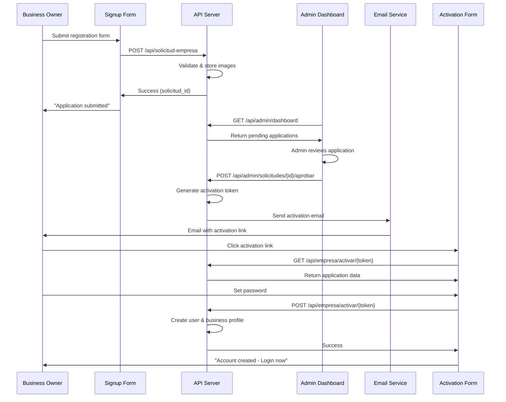

## Overview

BeanQuick implements a secure three-stage business registration process that ensures only legitimate businesses can join the platform. The workflow involves initial signup, admin review, and email-based account activation.

## Registration Workflow

### Stage 1: Business Signup

Businesses submit a registration request through the public signup form.

**Endpoint:** `POST /api/solicitud-empresa`

**Required Fields:**

| Field | Type | Validation | Description |
|-------|------|------------|-------------|
| `nombre` | string | required, max:255 | Business name |
| `correo` | string | required, email, unique | Business email (must be unique) |
| `nit` | string | nullable, max:50 | Tax identification number |
| `telefono` | string | nullable, max:50 | Contact phone number |
| `direccion` | string | nullable, max:255 | Physical address |
| `descripcion` | text | nullable | Business description |
| `logo` | file | nullable, image, max:2MB | Business logo (jpeg, png, jpg, webp) |
| `foto_local` | file | nullable, image, max:4MB | Store photo (jpeg, png, jpg, webp) |

**Example Request:**

```javascript
const formData = new FormData();
formData.append('nombre', 'Café del Centro');
formData.append('correo', 'contacto@cafedelcentro.com');
formData.append('nit', '900123456-7');
formData.append('telefono', '+57 312 456 7890');
formData.append('direccion', 'Calle 10 #5-20, Bogotá');
formData.append('descripcion', 'Cafetería especializada en café colombiano');
formData.append('logo', logoFile);
formData.append('foto_local', storePhotoFile);

const response = await fetch('/api/solicitud-empresa', {
  method: 'POST',
  body: formData
});
```

**Success Response:**

```json
{
  "status": "success",
  "message": "Tu solicitud fue enviada correctamente. Nuestro equipo la revisará pronto.",
  "solicitud_id": 15
}
```

<Info>
**Image Storage:** Uploaded images are stored temporarily in `storage/app/public/solicitudes/` until the business is approved.
- Logos: `solicitudes/logos/`
- Store photos: `solicitudes/locales/`
</Info>

### Stage 2: Admin Review

Administrators review pending applications from the admin dashboard.

#### View Pending Applications

**Endpoint:** `GET /api/admin/dashboard`

```json
{
  "solicitudes": [
    {
      "id": 15,
      "nombre": "Café del Centro",
      "correo": "contacto@cafedelcentro.com",
      "nit": "900123456-7",
      "telefono": "+57 312 456 7890",
      "direccion": "Calle 10 #5-20, Bogotá",
      "descripcion": "Cafetería especializada en café colombiano",
      "estado": "pendiente",
      "logo_url": "http://localhost:8000/storage/solicitudes/logos/abc123.jpg",
      "foto_local_url": "http://localhost:8000/storage/solicitudes/locales/def456.jpg"
    }
  ]
}
```

#### Approve Application

**Endpoint:** `POST /api/admin/solicitudes/{id}/aprobar`

When approved, the system:
1. Generates a secure 60-character activation token
2. Updates the application status to `'aprobado'`
3. Sends an activation email with a unique link

**Activation Link Format:**
```
http://localhost:5173/empresa/activar/{token}
```

**Email Template:** `ActivacionEmpresaMail`

**Success Response:**

```json
{
  "message": "Solicitud aprobada y correo de activación enviado.",
  "solicitud": {
    "id": 15,
    "estado": "aprobado",
    "token": "randomstring60characters..."
  }
}
```

#### Reject Application

**Endpoint:** `POST /api/admin/solicitudes/{id}/rechazar`

```json
{
  "message": "Solicitud rechazada.",
  "solicitud": {
    "id": 15,
    "estado": "rechazado"
  }
}
```

### Stage 3: Account Activation

The business owner receives the activation email and completes account setup.

#### Validate Activation Token

**Endpoint:** `GET /api/empresa/activar/{token}`

```json
{
  "status": "success",
  "solicitud": {
    "nombre": "Café del Centro",
    "correo": "contacto@cafedelcentro.com",
    "nit": "900123456-7",
    "logo_url": "..."
  }
}
```

#### Complete Activation

**Endpoint:** `POST /api/empresa/activar/{token}`

**Required Fields:**

| Field | Validation | Description |
|-------|------------|-------------|
| `password` | required, confirmed, min:8 | Account password |
| `password_confirmation` | required, same as password | Password confirmation |

**Process Flow:**

<Steps>
  <Step title="Create User Account">
    Creates a new user record with role `'empresa'`
    ```php
    User::create([
      'name' => $solicitud->nombre,
      'email' => $solicitud->correo,
      'password' => Hash::make($request->password),
      'rol' => 'empresa'
    ]);
    ```
  </Step>
  
  <Step title="Move Images to Permanent Storage">
    - Logo: `solicitudes/logos/` → `empresas/logos/`
    - Store photo: `solicitudes/locales/` → `empresas/locales/`
  </Step>
  
  <Step title="Create Business Profile">
    Creates a record in the `empresas` table linked to the user
    ```php
    Empresa::create([
      'user_id' => $user->id,
      'nombre' => $solicitud->nombre,
      'nit' => $solicitud->nit,
      'direccion' => $solicitud->direccion,
      'telefono' => $solicitud->telefono,
      'descripcion' => $solicitud->descripcion,
      'logo' => 'empresas/logos/filename.jpg',
      'foto_local' => 'empresas/locales/filename.jpg',
      'is_open' => true
    ]);
    ```
  </Step>
  
  <Step title="Finalize Application">
    - Updates application status to `'completada'`
    - Nullifies the activation token
    - Deletes temporary image files
  </Step>
</Steps>

**Success Response:**

```json
{
  "status": "success",
  "message": "Cuenta creada exitosamente. Ya puedes iniciar sesión.",
  "user": {
    "id": 42,
    "name": "Café del Centro",
    "email": "contacto@cafedelcentro.com",
    "rol": "empresa"
  }
}
```

## Database Models

### SolicitudEmpresa Model

**Table:** `solicitudes_empresas`

**Fillable Fields:**
```php
'nombre', 'correo', 'nit', 'telefono', 'direccion', 
'descripcion', 'logo', 'foto_local', 'estado', 'token'
```

**Estado Values:**
- `'pendiente'` - Awaiting admin review (default)
- `'aprobado'` - Approved, activation email sent
- `'rechazado'` - Rejected by admin
- `'completada'` - Account activated successfully

**Appended Attributes:**
- `logo_url` - Full URL to logo image
- `foto_local_url` - Full URL to store photo

### Empresa Model

**Table:** `empresas`

**Fillable Fields:**
```php
'user_id', 'nombre', 'nit', 'direccion', 'telefono', 
'descripcion', 'logo', 'foto_local', 'is_open'
```

**Relationships:**
- `usuario()` - belongsTo User
- `productos()` - hasMany Producto
- `pedidos()` - hasMany Pedido

**Appended Attributes:**
- `logo_url` - Full URL to logo
- `foto_local_url` - Full URL to store photo

## Security Features

<AccordionGroup>
  <Accordion title="Token-Based Activation">
    - 60-character random string generated using `Str::random(60)`
    - Stored in database, validated on activation
    - Single-use token (nullified after activation)
    - Only valid for approved applications
  </Accordion>

  <Accordion title="Email Uniqueness">
    - Email must be unique in `solicitudes_empresas` table
    - Prevents duplicate applications
    - Additional check during activation to prevent race conditions
  </Accordion>

  <Accordion title="Transaction Safety">
    - Account creation wrapped in database transaction
    - Rollback on any error during:
      - User creation
      - Image file operations
      - Business profile creation
    - Ensures data consistency
  </Accordion>

  <Accordion title="File Upload Validation">
    - Validates file types (jpeg, png, jpg, webp)
    - Logo max size: 2MB
    - Store photo max size: 4MB
    - Stored in `public` disk with organized folder structure
  </Accordion>
</AccordionGroup>

## Error Handling

### Common Errors

| Error | HTTP Code | Reason |
|-------|-----------|--------|
| "El enlace de activación no es válido o ya fue usado" | 404 | Invalid token or already activated |
| "Ya existe una cuenta con este correo" | 422 | Email already registered |
| "Laravel no detecta el archivo logo" | 400 | Missing logo file in request |
| "Solicitud aprobada pero hubo un error al enviar el correo" | 500 | Email sending failed (approval successful) |

## User Journey



## Best Practices

<CardGroup cols={2}>
  <Card title="Form Validation" icon="check-circle">
    Always validate file uploads on the frontend before submission to improve UX and reduce server load.
  </Card>
  
  <Card title="Token Security" icon="shield">
    Never expose activation tokens in logs or error messages. Use secure HTTPS in production.
  </Card>
  
  <Card title="Email Delivery" icon="envelope">
    Implement retry logic for failed email deliveries. Log all email sending attempts for debugging.
  </Card>
  
  <Card title="Image Optimization" icon="image">
    Compress and resize images on the frontend before upload to reduce storage costs and improve load times.
  </Card>
</CardGroup>

## Implementation Example

### Frontend Registration Form (React)

```jsx
import { useState } from 'react';

function BusinessSignupForm() {
  const [formData, setFormData] = useState({
    nombre: '',
    correo: '',
    nit: '',
    telefono: '',
    direccion: '',
    descripcion: '',
    logo: null,
    foto_local: null
  });

  const handleSubmit = async (e) => {
    e.preventDefault();
    
    const data = new FormData();
    Object.keys(formData).forEach(key => {
      if (formData[key]) data.append(key, formData[key]);
    });

    try {
      const response = await fetch('/api/solicitud-empresa', {
        method: 'POST',
        body: data
      });
      
      const result = await response.json();
      
      if (response.ok) {
        alert('¡Solicitud enviada! Recibirás un correo cuando sea aprobada.');
      } else {
        alert(result.message || 'Error al enviar solicitud');
      }
    } catch (error) {
      console.error('Error:', error);
    }
  };

  return (
    <form onSubmit={handleSubmit}>
      <input
        type="text"
        placeholder="Nombre del negocio"
        value={formData.nombre}
        onChange={(e) => setFormData({...formData, nombre: e.target.value})}
        required
      />
      <input
        type="email"
        placeholder="Correo electrónico"
        value={formData.correo}
        onChange={(e) => setFormData({...formData, correo: e.target.value})}
        required
      />
      {/* Add other fields similarly */}
      <input
        type="file"
        accept="image/jpeg,image/png,image/jpg,image/webp"
        onChange={(e) => setFormData({...formData, logo: e.target.files[0]})}
      />
      <button type="submit">Enviar Solicitud</button>
    </form>
  );
}
```

## Related Features

<CardGroup cols={2}>
  <Card title="Product Management" icon="box" href="/features/product-management">
    Learn how businesses manage their product catalog after registration
  </Card>
  
  <Card title="Order Management" icon="receipt" href="/features/order-management">
    Understand how businesses receive and process customer orders
  </Card>
</CardGroup>