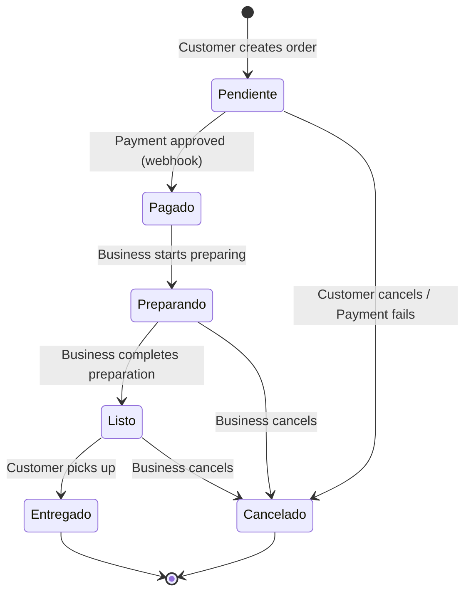

## Overview

BeanQuick implements a complete order management system with distinct workflows for customers and businesses. Orders progress through multiple states from creation to delivery, with integrated payment validation.

## Order Model Structure

### Pedido Model

**Table:** `pedidos`

**Fillable Fields:**
```php
'user_id', 'empresa_id', 'estado', 'estado_pago', 'hora_recogida', 'total'
```

**Relationships:**
- `cliente()` - belongsTo User (via `user_id`)
- `empresa()` - belongsTo Empresa
- `productos()` - belongsToMany Producto (pivot: `pedido_productos`)

**Casts:**
```php
'total' => 'float',
'hora_recogida' => 'datetime:H:i',
'created_at' => 'datetime:d/m/Y H:i'
```

### PedidoProducto Model (Pivot Table)

**Table:** `pedido_productos`

**Fillable Fields:**
```php
'pedido_id', 'producto_id', 'cantidad', 'precio_unitario'
```

**Purpose:** Stores a snapshot of the order at the time of purchase
- `precio_unitario` - Captures the product price at purchase time (prevents changes if product price is updated later)
- `cantidad` - Quantity ordered

**Appended Attributes:**
- `subtotal` - Calculated as `precio_unitario * cantidad`

**Casts:**
```php
'precio_unitario' => 'float',
'cantidad' => 'integer'
```

## Order States

### Estado (Logistical Status)

Tracks the physical/operational status of the order:

| Estado | Description | Who Can Set |
|--------|-------------|-------------|
| `Pendiente` | Order created, awaiting payment | System (on creation) |
| `Pagado` | Payment confirmed, business needs to prepare | System (webhook) |
| `Preparando` | Business is preparing the order | Business |
| `Listo` | Order ready for pickup | Business |
| `Entregado` | Order delivered/picked up | Business |
| `Cancelado` | Order cancelled | Customer or Business |

### Estado Pago (Payment Status)

Tracks the payment status independently:

| Estado Pago | Description | Set By |
|-------------|-------------|--------|
| `pendiente` | Payment not yet completed | System (on order creation) |
| `aprobado` | Payment successful | Webhook |
| `rechazado` | Payment failed or cancelled | Webhook |
| `reembolsado` | Payment refunded | Webhook |

<Info>
**Dual Status System:** BeanQuick separates logistical status (`estado`) from payment status (`estado_pago`) to handle cases where payment may be pending or fail while the order exists.
</Info>

## Order Creation Flow

### Checkout Preparation

**Endpoint:** `GET /api/pedido/checkout`

**Authentication:** Required (cliente role)

**Purpose:** Validates cart has items before allowing checkout

**Response:**

```json
{
  "carrito": {
    "id": 25,
    "user_id": 15
  },
  "productos": [
    {
      "id": 12,
      "nombre": "Café Latte",
      "precio": 7500.0,
      "pivot": {
        "cantidad": 2
      }
    }
  ]
}
```

### Create Order

**Endpoint:** `POST /api/pedido`

**Authentication:** Required (cliente role)

**Request Body:**

| Field | Type | Validation | Description |
|-------|------|------------|-------------|
| `empresa_id` | integer | required, exists:empresas,id | Store ID to order from |
| `hora_recogida` | string | required, format:HH:mm | Pickup time (24-hour format) |

**Example Request:**

```javascript
const response = await fetch('/api/pedido', {
  method: 'POST',
  headers: {
    'Authorization': `Bearer ${token}`,
    'Content-Type': 'application/json'
  },
  body: JSON.stringify({
    empresa_id: 3,
    hora_recogida: '15:30'
  })
});
```

**Success Response:**

```json
{
  "message": "Pedido generado pendiente de pago.",
  "pedido": {
    "id": 42,
    "user_id": 15,
    "empresa_id": 3,
    "estado": "Pendiente",
    "estado_pago": "pendiente",
    "hora_recogida": "15:30",
    "total": 15000.0,
    "created_at": "2026-03-05T12:30:00.000000Z",
    "productos": [
      {
        "id": 12,
        "nombre": "Café Latte",
        "pivot": {
          "pedido_id": 42,
          "producto_id": 12,
          "cantidad": 2,
          "precio_unitario": 7500.0
        }
      }
    ]
  }
}
```

### Order Creation Process

<Steps>
  <Step title="Check for Duplicate Pending Orders">
    Prevents creating multiple pending orders:
    ```php
    $pedidoExistente = Pedido::where('user_id', $user->id)
        ->where('estado', 'Pendiente')
        ->where('estado_pago', 'pendiente')
        ->first();
    
    if ($pedidoExistente) {
        return response()->json([
            'message' => 'Ya tienes un pedido pendiente de pago.',
            'pedido' => $pedidoExistente->load('productos')
        ], 200);
    }
    ```
  </Step>
  
  <Step title="Load Cart and Filter by Store">
    Only includes products from the specified store:
    ```php
    $productosTienda = $carrito->productos->filter(function ($producto) use ($request) {
        return (int)$producto->empresa_id === (int)$request->empresa_id;
    });
    
    if ($productosTienda->isEmpty()) {
        return response()->json([
            'message' => 'No hay productos de esta empresa en tu carrito.'
        ], 422);
    }
    ```
  </Step>
  
  <Step title="Validate Stock (Without Deducting)">
    Checks availability but doesn't reserve stock yet:
    ```php
    foreach ($productosTienda as $producto) {
        $cantidadPedida = $producto->pivot->cantidad ?? 1;

        if ($producto->stock < $cantidadPedida) {
            return response()->json([
                'message' => "Stock insuficiente para: {$producto->nombre}"
            ], 422);
        }
    }
    ```
  </Step>
  
  <Step title="Calculate Order Total">
    Sums up all products in the order:
    ```php
    $total = 0;
    foreach ($productosTienda as $producto) {
        $cantidad = $producto->pivot->cantidad ?? 1;
        $precio = $producto->precio ?? 0;
        $total += $precio * $cantidad;
    }
    ```
  </Step>
  
  <Step title="Create Order Record">
    Creates order with pending payment status:
    ```php
    $pedido = Pedido::create([
        'empresa_id' => $request->empresa_id,
        'user_id' => $user->id,
        'estado' => 'Pendiente',
        'hora_recogida' => $request->hora_recogida,
        'total' => $total,
        'estado_pago' => 'pendiente'
    ]);
    ```
  </Step>
  
  <Step title="Record Order Items">
    Creates pivot records with price snapshot:
    ```php
    foreach ($productosTienda as $producto) {
        PedidoProducto::create([
            'pedido_id' => $pedido->id,
            'producto_id' => $producto->id,
            'cantidad' => $producto->pivot->cantidad ?? 1,
            'precio_unitario' => $producto->precio ?? 0,
        ]);
    }
    ```
  </Step>
</Steps>

<Warning>
**Stock Reservation:** Stock is NOT deducted when the order is created. It's only deducted when payment is confirmed via the Mercado Pago webhook. See [Payments](/features/payments) for details.
</Warning>

**Complete Controller Logic:**

```php
public function store(Request $request): JsonResponse
{
    $user = Auth::user();

    // Prevent duplicate pending orders
    $pedidoExistente = Pedido::where('user_id', $user->id)
        ->where('estado', 'Pendiente')
        ->where('estado_pago', 'pendiente')
        ->first();
    
    if ($pedidoExistente) {
        return response()->json([
            'message' => 'Ya tienes un pedido pendiente de pago.',
            'pedido' => $pedidoExistente->load('productos')
        ], 200);
    }
      
    $request->validate([
        'empresa_id' => 'required|exists:empresas,id',
        'hora_recogida' => 'required|date_format:H:i'
    ]);

    return \DB::transaction(function () use ($user, $request) {
        
        $carrito = Carrito::where('user_id', $user->id)
            ->with('productos')
            ->first();

        if (!$carrito || $carrito->productos->isEmpty()) {
            return response()->json(['message' => 'Tu carrito está vacío.'], 400);
        }

        $productosTienda = $carrito->productos->filter(function ($producto) use ($request) {
            return (int)$producto->empresa_id === (int)$request->empresa_id;
        });

        if ($productosTienda->isEmpty()) {
            return response()->json([
                'message' => 'No hay productos de esta empresa en tu carrito.'
            ], 422);
        }

        // Validate stock (but don't deduct)
        foreach ($productosTienda as $producto) {
            $cantidadPedida = $producto->pivot->cantidad ?? 1;

            if ($producto->stock < $cantidadPedida) {
                return response()->json([
                    'message' => "Stock insuficiente para: {$producto->nombre}"
                ], 422);
            }
        }

        // Calculate total
        $total = 0;
        foreach ($productosTienda as $producto) {
            $cantidad = $producto->pivot->cantidad ?? 1;
            $precio = $producto->precio ?? 0;
            $total += $precio * $cantidad;
        }

        // Create order
        $pedido = Pedido::create([
            'empresa_id' => $request->empresa_id,
            'user_id' => $user->id,
            'estado' => 'Pendiente',
            'hora_recogida' => $request->hora_recogida,
            'total' => $total,
            'estado_pago' => 'pendiente'
        ]);

        // Record products
        foreach ($productosTienda as $producto) {
            PedidoProducto::create([
                'pedido_id' => $pedido->id,
                'producto_id' => $producto->id,
                'cantidad' => $producto->pivot->cantidad ?? 1,
                'precio_unitario' => $producto->precio ?? 0,
            ]);
        }

        return response()->json([
            'message' => 'Pedido generado pendiente de pago.',
            'pedido' => $pedido->load('productos')
        ], 201);
    });
}
```

## Order Viewing

### Customer View (Order History)

**Endpoint:** `GET /api/cliente/pedidos`

**Authentication:** Required (cliente role)

**Returns:** All orders placed by the authenticated customer

**Response:**

```json
[
  {
    "id": 42,
    "user_id": 15,
    "empresa_id": 3,
    "estado": "Entregado",
    "estado_pago": "aprobado",
    "hora_recogida": "15:30",
    "total": 15000.0,
    "created_at": "05/03/2026 12:30",
    "empresa": {
      "id": 3,
      "nombre": "Café del Centro",
      "direccion": "Calle 10 #5-20",
      "telefono": "+57 312 456 7890"
    },
    "productos": [
      {
        "id": 12,
        "nombre": "Café Latte",
        "imagen_url": "...",
        "pivot": {
          "cantidad": 2,
          "precio_unitario": 7500.0,
          "subtotal": 15000.0
        }
      }
    ]
  }
]
```

**Controller Logic:**

```php
public function indexCliente(): JsonResponse
{
    $pedidos = Pedido::where('user_id', Auth::id())
        ->with(['empresa', 'productos'])
        ->orderBy('created_at', 'desc')
        ->get();

    return response()->json($pedidos);
}
```

### Business View (Incoming Orders)

**Endpoint:** `GET /api/empresa/pedidos`

**Authentication:** Required (empresa role)

**Returns:** All **paid** orders for the authenticated business

**Response:**

```json
[
  {
    "id": 42,
    "user_id": 15,
    "empresa_id": 3,
    "estado": "Pagado",
    "estado_pago": "aprobado",
    "hora_recogida": "15:30",
    "total": 15000.0,
    "created_at": "05/03/2026 12:30",
    "cliente": {
      "id": 15,
      "name": "Juan Pérez",
      "email": "juan@example.com"
    },
    "productos": [
      {
        "id": 12,
        "nombre": "Café Latte",
        "pivot": {
          "cantidad": 2,
          "precio_unitario": 7500.0
        }
      }
    ]
  }
]
```

**Controller Logic:**

```php
public function indexEmpresa(): JsonResponse
{
    $user = Auth::user();

    $empresa = Empresa::where('user_id', $user->id)->first();

    if (!$empresa) {
        return response()->json([
            'message' => 'No tienes empresa asociada.'
        ], 404);
    }

    // Only show paid orders
    $pedidos = Pedido::where('empresa_id', $empresa->id)
        ->where('estado_pago', 'aprobado')
        ->with(['productos', 'cliente'])
        ->orderBy('created_at', 'asc')
        ->get();

    return response()->json($pedidos);
}
```

<Info>
**Business Orders Filter:** Businesses only see orders with `estado_pago = 'aprobado'`. Unpaid orders are not shown to avoid confusion.
</Info>

## Order Status Updates

### Customer: Cancel Order

**Endpoint:** `POST /api/pedido/{id}/cancelar`

**Authentication:** Required (cliente role)

**Authorization:** Order must belong to authenticated customer

**Business Rules:**
- Can only cancel orders in `'Pendiente'` estado
- If order was already paid (`estado_pago = 'aprobado'`), stock is restored
- If order was unpaid, stock was never deducted

**Success Response:**

```json
{
  "message": "Pedido cancelado y stock devuelto"
}
```

**Error Responses:**

```json
// Order not in Pendiente state
{
  "message": "No puedes cancelar un pedido Preparando"
}

// Order not found
{
  "message": "Pedido no encontrado"
}
```

**Controller Logic:**

```php
public function cancelar($id): JsonResponse
{
    try {
        $user = Auth::user();
        $pedido = Pedido::where('id', $id)
            ->where('user_id', $user->id)
            ->with('productos')
            ->first();

        if (!$pedido) {
            return response()->json(['message' => 'Pedido no encontrado'], 404);
        }

        if (strtolower($pedido->estado) !== 'pendiente') {
            return response()->json([
                'message' => 'No puedes cancelar un pedido ' . $pedido->estado
            ], 400);
        }

        \DB::transaction(function () use ($pedido) {
        
            // Only restore stock if already paid
            if ($pedido->estado_pago === 'aprobado') {
                foreach ($pedido->productos as $producto) {
                    $producto->increment('stock', $producto->pivot->cantidad);
                }
            }
        
            $pedido->update([
                'estado' => 'Cancelado',
                'estado_pago' => 'rechazado'
            ]);
        });

        return response()->json(['message' => 'Pedido cancelado y stock devuelto']);

    } catch (\Exception $e) {
        return response()->json([
            'message' => 'Error', 
            'error' => $e->getMessage()
        ], 500);
    }
}
```

### Business: Update Order Status

**Endpoint:** `PUT /api/empresa/pedido/{id}/estado`

**Authentication:** Required (empresa role)

**Authorization:** Order must belong to authenticated business

**Request Body:**

| Field | Validation | Allowed Values |
|-------|------------|----------------|
| `estado` | required | `Preparando`, `Listo`, `Entregado`, `Cancelado` |

**Example Request:**

```javascript
const response = await fetch('/api/empresa/pedido/42/estado', {
  method: 'PUT',
  headers: {
    'Authorization': `Bearer ${token}`,
    'Content-Type': 'application/json'
  },
  body: JSON.stringify({
    estado: 'Preparando'
  })
});
```

**Success Response:**

```json
{
  "message": "Estado actualizado con éxito",
  "pedido": {
    "id": 42,
    "estado": "Preparando",
    "estado_pago": "aprobado"
  }
}
```

**Error Response:**

```json
// Order not paid yet
{
  "message": "No puedes modificar un pedido que no ha sido pagado."
}
```

**Controller Logic:**

```php
public function actualizarEstado(Request $request, $id): JsonResponse
{
    $request->validate([
        'estado' => 'required|in:Preparando,Listo,Entregado,Cancelado'
    ]);

    try {
        $pedido = Pedido::findOrFail($id);

        // Block if not paid
        if ($pedido->estado_pago !== 'aprobado') {
            return response()->json([
                'message' => 'No puedes modificar un pedido que no ha sido pagado.'
            ], 400);
        }
        
        $nuevoEstado = ucfirst(strtolower($request->estado));
        
        $pedido->update([
            'estado' => $nuevoEstado
        ]);
        
        return response()->json([
            'message' => 'Estado actualizado con éxito',
            'pedido' => $pedido
        ]);
        
    } catch (\Exception $e) {
        return response()->json([
            'message' => 'Error en el servidor',
            'error' => $e->getMessage()
        ], 500);
    }
}
```

<Warning>
**Payment Required:** Businesses can only update the status of orders that have been paid (`estado_pago = 'aprobado'`). This prevents managing orders that may never be completed.
</Warning>

## Order Lifecycle



## Implementation Example

### React Order Tracking Component (Customer)

```jsx
import { useState, useEffect } from 'react';

function OrderHistory() {
  const [orders, setOrders] = useState([]);
  const [loading, setLoading] = useState(true);

  useEffect(() => {
    loadOrders();
  }, []);

  const loadOrders = async () => {
    try {
      const response = await fetch('/api/cliente/pedidos', {
        headers: {
          'Authorization': `Bearer ${localStorage.getItem('token')}`
        }
      });
      const data = await response.json();
      setOrders(data);
    } catch (error) {
      console.error('Error loading orders:', error);
    } finally {
      setLoading(false);
    }
  };

  const cancelOrder = async (orderId) => {
    if (!confirm('¿Estás seguro de cancelar este pedido?')) return;

    try {
      const response = await fetch(`/api/pedido/${orderId}/cancelar`, {
        method: 'POST',
        headers: {
          'Authorization': `Bearer ${localStorage.getItem('token')}`
        }
      });

      const result = await response.json();

      if (response.ok) {
        alert(result.message);
        loadOrders(); // Reload orders
      } else {
        alert(result.message);
      }
    } catch (error) {
      console.error('Error cancelling order:', error);
    }
  };

  const getStatusBadge = (estado) => {
    const colors = {
      'Pendiente': 'bg-yellow-500',
      'Pagado': 'bg-blue-500',
      'Preparando': 'bg-orange-500',
      'Listo': 'bg-green-500',
      'Entregado': 'bg-gray-500',
      'Cancelado': 'bg-red-500'
    };
    return colors[estado] || 'bg-gray-500';
  };

  if (loading) return <div>Cargando pedidos...</div>;

  return (
    <div className="orders-container">
      <h2>Mis Pedidos</h2>
      
      {orders.length === 0 ? (
        <p>No tienes pedidos aún</p>
      ) : (
        <div className="orders-list">
          {orders.map(order => (
            <div key={order.id} className="order-card">
              <div className="order-header">
                <h3>Pedido #{order.id}</h3>
                <span className={`badge ${getStatusBadge(order.estado)}`}>
                  {order.estado}
                </span>
              </div>
              
              <div className="order-info">
                <p><strong>Tienda:</strong> {order.empresa.nombre}</p>
                <p><strong>Hora de recogida:</strong> {order.hora_recogida}</p>
                <p><strong>Total:</strong> ${order.total.toFixed(2)}</p>
                <p><strong>Fecha:</strong> {order.created_at}</p>
              </div>
              
              <div className="order-products">
                <h4>Productos:</h4>
                {order.productos.map(producto => (
                  <div key={producto.id} className="product-item">
                    
                    <span>{producto.nombre}</span>
                    <span>x{producto.pivot.cantidad}</span>
                    <span>${producto.pivot.subtotal.toFixed(2)}</span>
                  </div>
                ))}
              </div>
              
              {order.estado === 'Pendiente' && (
                <div className="order-actions">
                  {order.estado_pago === 'pendiente' && (
                    <button 
                      className="btn-pay"
                      onClick={() => window.location.href = `/pago/${order.id}`}
                    >
                      Pagar Ahora
                    </button>
                  )}
                  <button 
                    className="btn-cancel"
                    onClick={() => cancelOrder(order.id)}
                  >
                    Cancelar Pedido
                  </button>
                </div>
              )}
              
              {order.estado === 'Entregado' && (
                <button 
                  className="btn-review"
                  onClick={() => window.location.href = `/calificar/${order.id}`}
                >
                  Calificar Productos
                </button>
              )}
            </div>
          ))}
        </div>
      )}
    </div>
  );
}

export default OrderHistory;
```

### React Order Management Component (Business)

```jsx
import { useState, useEffect } from 'react';

function BusinessOrders() {
  const [orders, setOrders] = useState([]);
  const [filter, setFilter] = useState('all'); // 'all', 'Pagado', 'Preparando', etc.

  useEffect(() => {
    loadOrders();
    const interval = setInterval(loadOrders, 30000); // Refresh every 30s
    return () => clearInterval(interval);
  }, []);

  const loadOrders = async () => {
    try {
      const response = await fetch('/api/empresa/pedidos', {
        headers: {
          'Authorization': `Bearer ${localStorage.getItem('token')}`
        }
      });
      const data = await response.json();
      setOrders(data);
    } catch (error) {
      console.error('Error loading orders:', error);
    }
  };

  const updateStatus = async (orderId, newStatus) => {
    try {
      const response = await fetch(`/api/empresa/pedido/${orderId}/estado`, {
        method: 'PUT',
        headers: {
          'Authorization': `Bearer ${localStorage.getItem('token')}`,
          'Content-Type': 'application/json'
        },
        body: JSON.stringify({ estado: newStatus })
      });

      const result = await response.json();

      if (response.ok) {
        loadOrders(); // Reload orders
      } else {
        alert(result.message);
      }
    } catch (error) {
      console.error('Error updating status:', error);
    }
  };

  const filteredOrders = filter === 'all' 
    ? orders 
    : orders.filter(order => order.estado === filter);

  return (
    <div className="business-orders">
      <h2>Pedidos Recibidos</h2>
      
      <div className="filters">
        <button onClick={() => setFilter('all')}>Todos</button>
        <button onClick={() => setFilter('Pagado')}>Pagados</button>
        <button onClick={() => setFilter('Preparando')}>Preparando</button>
        <button onClick={() => setFilter('Listo')}>Listos</button>
        <button onClick={() => setFilter('Entregado')}>Entregados</button>
      </div>
      
      <div className="orders-grid">
        {filteredOrders.map(order => (
          <div key={order.id} className="order-card">
            <h3>Pedido #{order.id}</h3>
            <p><strong>Cliente:</strong> {order.cliente.name}</p>
            <p><strong>Hora de recogida:</strong> {order.hora_recogida}</p>
            <p><strong>Total:</strong> ${order.total.toFixed(2)}</p>
            
            <div className="products">
              {order.productos.map(p => (
                <div key={p.id}>
                  {p.pivot.cantidad}x {p.nombre}
                </div>
              ))}
            </div>
            
            <div className="status-controls">
              <select 
                value={order.estado}
                onChange={(e) => updateStatus(order.id, e.target.value)}
              >
                <option value="Pagado">Pagado</option>
                <option value="Preparando">Preparando</option>
                <option value="Listo">Listo</option>
                <option value="Entregado">Entregado</option>
              </select>
            </div>
          </div>
        ))}
      </div>
    </div>
  );
}

export default BusinessOrders;
```

## Best Practices

<CardGroup cols={2}>
  <Card title="Stock Management" icon="boxes-stacked">
    Never deduct stock on order creation. Only deduct after payment confirmation to prevent overselling.
  </Card>
  
  <Card title="Price Snapshots" icon="camera">
    Always store `precio_unitario` in order items to preserve the price at purchase time.
  </Card>
  
  <Card title="Status Validation" icon="shield-check">
    Validate payment status before allowing businesses to update order status.
  </Card>
  
  <Card title="Real-Time Updates" icon="arrows-rotate">
    Implement polling or WebSockets for businesses to see new orders in real-time.
  </Card>
</CardGroup>

## Related Features

<CardGroup cols={2}>
  <Card title="Shopping Cart" icon="cart-shopping" href="/features/shopping-cart">
    Learn how orders are created from cart contents
  </Card>
  
  <Card title="Payments" icon="credit-card" href="/features/payments">
    Understand payment confirmation and stock deduction
  </Card>
  
  <Card title="Ratings & Reviews" icon="star" href="/features/ratings-reviews">
    Learn how customers rate products after delivery
  </Card>
</CardGroup>