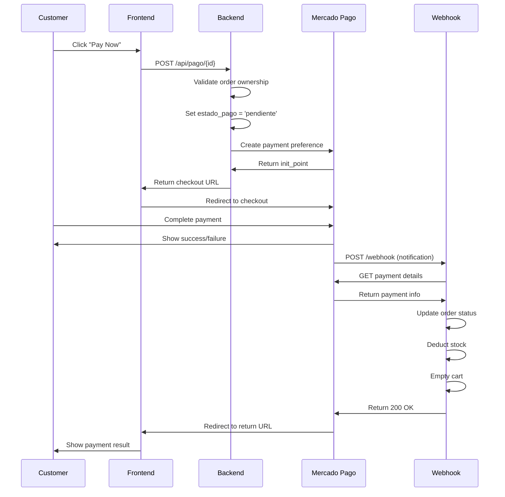

## Overview

BeanQuick integrates with Mercado Pago to process payments securely. The payment system uses a webhook-based flow where stock is only deducted after payment confirmation, preventing overselling and ensuring transaction integrity.

## Mercado Pago Integration

### SDK Configuration

BeanQuick uses the official Mercado Pago PHP SDK:

```php
use MercadoPago\Client\Preference\PreferenceClient;
use MercadoPago\MercadoPagoConfig;
use MercadoPago\Client\Payment\PaymentClient;

// Configure access token
$token = config('services.mercadopago.access_token');
MercadoPagoConfig::setAccessToken($token);
```

### Environment Configuration

Add to `.env`:

```env
MERCADOPAGO_ACCESS_TOKEN=your_access_token_here
WEBHOOK_URL=https://yourdomain.com/api/webhook/mercadopago
APP_FRONTEND_URL=http://localhost:5173
```

Add to `config/services.php`:

```php
'mercadopago' => [
    'access_token' => env('MERCADOPAGO_ACCESS_TOKEN'),
],
```

<Info>
**Testing:** Use Mercado Pago's test credentials for development. Switch to production credentials before deploying.
</Info>

## Payment Flow

### Step 1: Create Payment Preference

**Endpoint:** `POST /api/pago/{pedido_id}`

**Authentication:** Required (cliente role)

**Authorization:** Customer must own the order

**Purpose:** Generates a Mercado Pago checkout link

**Request:**

```javascript
const response = await fetch('/api/pago/42', {
  method: 'POST',
  headers: {
    'Authorization': `Bearer ${token}`
  }
});

const data = await response.json();
// Redirect user to Mercado Pago checkout
window.location.href = data.init_point;
```

**Success Response:**

```json
{
  "init_point": "https://www.mercadopago.com.co/checkout/v1/redirect?pref_id=123456789-abcd-efgh-ijkl-123456789012"
}
```

**Error Responses:**

```json
// Not authorized
{
  "message": "No autorizado para pagar este pedido."
}

// Already paid
{
  "message": "Este pedido ya fue pagado."
}
```

### Payment Preference Creation Logic

<Steps>
  <Step title="Validate Order Ownership">
    Ensures the authenticated user owns the order:
    ```php
    $pedido = Pedido::findOrFail($id);

    if ($pedido->user_id !== auth()->id()) {
        return response()->json([
            'message' => 'No autorizado para pagar este pedido.'
        ], 403);
    }
    ```
  </Step>
  
  <Step title="Check Payment Status">
    Prevents duplicate payments:
    ```php
    if ($pedido->estado_pago === 'aprobado') {
        return response()->json([
            'message' => 'Este pedido ya fue pagado.'
        ], 400);
    }
    ```
  </Step>
  
  <Step title="Mark Payment as Pending">
    Updates status to track payment attempt:
    ```php
    $pedido->estado_pago = 'pendiente';
    $pedido->save();
    ```
  </Step>
  
  <Step title="Create Payment Preference">
    Configures Mercado Pago checkout:
    ```php
    $client = new PreferenceClient();

    $preference = $client->create([
        "items" => [
            [
                "title" => "Pedido BeanQuick #" . $pedido->id,
                "quantity" => 1,
                "unit_price" => (float) $pedido->total
            ]
        ],
        "external_reference" => (string) $pedido->id,
        "notification_url" => env('WEBHOOK_URL'),
        "back_urls" => [
            "success" => env('APP_FRONTEND_URL') . "/pago-exitoso",
            "failure" => env('APP_FRONTEND_URL') . "/pago-fallido",
            "pending" => env('APP_FRONTEND_URL') . "/pago-pendiente"
        ],
        "auto_return" => "approved",
    ]);
    ```
  </Step>
  
  <Step title="Return Checkout URL">
    Frontend redirects user to Mercado Pago:
    ```php
    return response()->json([
        "init_point" => $preference->init_point
    ]);
    ```
  </Step>
</Steps>

**Complete Controller Method:**

```php
public function pagar($id)
{
    $pedido = Pedido::findOrFail($id);

    if ($pedido->user_id !== auth()->id()) {
        return response()->json([
            'message' => 'No autorizado para pagar este pedido.'
        ], 403);
    }

    if ($pedido->estado_pago === 'aprobado') {
        return response()->json([
            'message' => 'Este pedido ya fue pagado.'
        ], 400);
    }

    // Mark as pending
    $pedido->estado_pago = 'pendiente';
    $pedido->save();

    $token = config('services.mercadopago.access_token');
    MercadoPagoConfig::setAccessToken($token);

    $client = new PreferenceClient();

    $preference = $client->create([
        "items" => [
            [
                "title" => "Pedido BeanQuick #" . $pedido->id,
                "quantity" => 1,
                "unit_price" => (float) $pedido->total
            ]
        ],
        "external_reference" => (string) $pedido->id,
        "notification_url" => env('WEBHOOK_URL'),
        "back_urls" => [
            "success" => env('APP_FRONTEND_URL') . "/pago-exitoso",
            "failure" => env('APP_FRONTEND_URL') . "/pago-fallido",
            "pending" => env('APP_FRONTEND_URL') . "/pago-pendiente"
        ],
        "auto_return" => "approved",
    ]);

    return response()->json([
        "init_point" => $preference->init_point
    ]);
}
```

### Step 2: Customer Completes Payment

The customer is redirected to Mercado Pago's secure checkout page where they:
1. Select payment method (credit card, debit card, cash, etc.)
2. Enter payment details
3. Confirm the transaction

### Step 3: Webhook Receives Notification

Mercado Pago sends a notification to your webhook endpoint when payment status changes.

**Endpoint:** `POST /api/webhook/mercadopago`

**Authentication:** Not required (webhook endpoint)

**Request Body (from Mercado Pago):**

```json
{
  "type": "payment",
  "data": {
    "id": "1234567890"
  }
}
```

<Warning>
**Webhook Security:** In production, validate the webhook signature using Mercado Pago's x-signature header to ensure requests are legitimate.
</Warning>

## Webhook Implementation

### Webhook Processing Flow

<Steps>
  <Step title="Log Incoming Request">
    Record all webhook calls for debugging:
    ```php
    \Log::info('WEBHOOK RECIBIDO:', $request->all());
    ```
  </Step>
  
  <Step title="Validate Topic Type">
    Only process payment notifications:
    ```php
    $topic = $request->input('type') ?? $request->input('topic');

    if ($topic !== 'payment') {
        return response()->json(['ok' => true]);
    }
    ```
  </Step>
  
  <Step title="Extract Payment ID">
    Get payment ID from request:
    ```php
    $paymentId = $request->input('data.id') 
        ?? $request->input('resource') 
        ?? $request->input('id');

    if (!$paymentId) {
        return response()->json(['ok' => true]);
    }
    ```
  </Step>
  
  <Step title="Fetch Payment Details">
    Query Mercado Pago API for payment information:
    ```php
    $client = new PaymentClient();
    sleep(2); // Wait for synchronization
    $payment = $client->get($paymentId);
    ```
  </Step>
  
  <Step title="Find Associated Order">
    Match payment to order using external_reference:
    ```php
    $pedido = Pedido::with('productos')->find($payment->external_reference);

    if (!$pedido) {
        return response()->json(['ok' => true]);
    }
    ```
  </Step>
  
  <Step title="Map Payment Status">
    Convert Mercado Pago status to internal status:
    ```php
    $nuevoEstado = null;

    switch ($payment->status) {
        case 'approved':
            $nuevoEstado = 'aprobado';
            break;
        case 'pending':
        case 'in_process':
            $nuevoEstado = 'pendiente';
            break;
        case 'rejected':
        case 'cancelled':
            $nuevoEstado = 'rechazado';
            break;
        case 'refunded':
        case 'charged_back':
            $nuevoEstado = 'reembolsado';
            break;
        default:
            return response()->json(['ok' => true]);
    }
    ```
  </Step>
  
  <Step title="Process Approved Payment">
    When payment is approved:
    - Update order status to 'Pagado'
    - Deduct stock from products
    - Empty customer's cart
    ```php
    if ($nuevoEstado === 'aprobado') {
        $pedido->estado = 'Pagado';
        $pedido->save();

        // Deduct stock
        foreach ($pedido->productos as $producto) {
            $cantidad = $producto->pivot->cantidad;
            $producto->decrement('stock', $cantidad);
        }

        // Empty cart
        $carrito = \App\Models\Carrito::where('user_id', $pedido->user_id)->first();
        if ($carrito) {
            $carrito->productos()->detach();
        }
    }
    ```
  </Step>
</Steps>

**Complete Webhook Controller:**

```php
public function webhook(Request $request)
{
    \Log::info('WEBHOOK RECIBIDO:', $request->all());

    $topic = $request->input('type') ?? $request->input('topic');

    if ($topic !== 'payment') {
        return response()->json(['ok' => true]);
    }

    $paymentId = $request->input('data.id') 
        ?? $request->input('resource') 
        ?? $request->input('id');

    if (!$paymentId) {
        return response()->json(['ok' => true]);
    }

    $token = config('services.mercadopago.access_token');
    MercadoPagoConfig::setAccessToken($token);

    $client = new PaymentClient();

    try {

        sleep(2); // Wait for synchronization

        $payment = $client->get($paymentId);

        \Log::info('PAYMENT COMPLETO:', [
            'status' => $payment->status,
            'external_reference' => $payment->external_reference
        ]);

        if (!$payment->external_reference) {
            return response()->json(['ok' => true]);
        }

        $pedido = Pedido::with('productos')->find($payment->external_reference);

        if (!$pedido) {
            return response()->json(['ok' => true]);
        }

        $nuevoEstado = null;

        switch ($payment->status) {

            case 'approved':
                $nuevoEstado = 'aprobado';
                break;

            case 'pending':
            case 'in_process':
                $nuevoEstado = 'pendiente';
                break;

            case 'rejected':
            case 'cancelled':
                $nuevoEstado = 'rechazado';
                break;

            case 'refunded':
            case 'charged_back':
                $nuevoEstado = 'reembolsado';
                break;

            default:
                return response()->json(['ok' => true]);
        }

        // Only process if status changed (avoid duplicates)
        if ($pedido->estado_pago !== $nuevoEstado) {

            \DB::transaction(function () use ($pedido, $nuevoEstado) {

                $pedido->estado_pago = $nuevoEstado;
                $pedido->save();

                // If payment approved
                if ($nuevoEstado === 'aprobado') {

                    // Change logistical status
                    $pedido->estado = 'Pagado';
                    $pedido->save();

                    // Deduct stock
                    foreach ($pedido->productos as $producto) {
                        $cantidad = $producto->pivot->cantidad;
                        $producto->decrement('stock', $cantidad);
                    }

                    // Empty cart
                    $carrito = \App\Models\Carrito::where('user_id', $pedido->user_id)->first();
                    if ($carrito) {
                        $carrito->productos()->detach();
                    }

                    \Log::info('PEDIDO PAGADO - STOCK DESCONTADO - CARRITO VACIADO', [
                        'pedido_id' => $pedido->id
                    ]);
                }
            });

            \Log::info('PEDIDO ACTUALIZADO', [
                'pedido_id' => $pedido->id,
                'nuevo_estado' => $nuevoEstado
            ]);
        }

    } catch (\Exception $e) {

        \Log::error('ERROR COMPLETO MP:', [
            'message' => $e->getMessage(),
            'payment_id' => $paymentId
        ]);
    }

    return response()->json(['ok' => true]);
}
```

## Payment Status Mapping

### Mercado Pago Statuses

| MP Status | Description | BeanQuick Estado Pago |
|-----------|-------------|----------------------|
| `approved` | Payment approved | `aprobado` |
| `pending` | Payment pending | `pendiente` |
| `in_process` | Payment being processed | `pendiente` |
| `rejected` | Payment rejected | `rechazado` |
| `cancelled` | Payment cancelled | `rechazado` |
| `refunded` | Payment refunded | `reembolsado` |
| `charged_back` | Chargeback issued | `reembolsado` |

## Stock Deduction Strategy

<AccordionGroup>
  <Accordion title="Why Deduct After Payment?">
    BeanQuick uses a "deduct on payment confirmation" strategy to prevent:
    
    - **Overselling:** If stock was deducted on order creation, abandoned payments would lock stock
    - **Race conditions:** Multiple customers could order the same product before payment
    - **Fraud:** Malicious users couldn't reserve stock without paying
  </Accordion>

  <Accordion title="Stock Validation Timeline">
    1. **Cart Add:** Check stock availability
    2. **Order Creation:** Validate stock but don't deduct
    3. **Payment Pending:** Stock still available for other customers
    4. **Payment Approved:** Stock deducted via webhook
    5. **Order Cancelled (Paid):** Stock restored
  </Accordion>

  <Accordion title="Potential Race Condition">
    **Scenario:** Two customers order the last product simultaneously
    
    **Risk:** Both orders pass validation before either payment completes
    
    **Mitigation:** 
    - Use database transactions with row locking
    - Implement stock reservation with timeout
    - Notify customer immediately if stock runs out after payment
  </Accordion>
</AccordionGroup>

## Cart Clearing

When payment is approved, the customer's **entire cart** is emptied:

```php
$carrito = \App\Models\Carrito::where('user_id', $pedido->user_id)->first();
if ($carrito) {
    $carrito->productos()->detach();
}
```

<Info>
**Multi-Store Carts:** Since BeanQuick allows products from multiple stores in one cart, only the products from the paid order are included. Other stores' products remain in cart and are cleared when their respective orders are paid.
</Info>

## Frontend Return URLs

Mercado Pago redirects customers back to your app after payment:

### Success URL

`/pago-exitoso` - Payment was approved

```jsx
function PaymentSuccess() {
  return (
    <div className="success-page">
      <h1>¡Pago Exitoso!</h1>
      <p>Tu pedido ha sido confirmado.</p>
      <a href="/mis-pedidos">Ver mis pedidos</a>
    </div>
  );
}
```

### Failure URL

`/pago-fallido` - Payment was rejected

```jsx
function PaymentFailure() {
  return (
    <div className="failure-page">
      <h1>Pago Rechazado</h1>
      <p>No se pudo procesar tu pago. Intenta nuevamente.</p>
      <a href="/mis-pedidos">Volver a intentar</a>
    </div>
  );
}
```

### Pending URL

`/pago-pendiente` - Payment is being processed

```jsx
function PaymentPending() {
  return (
    <div className="pending-page">
      <h1>Pago Pendiente</h1>
      <p>Tu pago está siendo procesado. Te notificaremos cuando se confirme.</p>
      <a href="/mis-pedidos">Ver mis pedidos</a>
    </div>
  );
}
```

<Warning>
**Important:** The return URLs are for **user experience only**. Never rely on them for order status updates. Always use the webhook for transaction processing.
</Warning>

## Webhook Configuration

### Register Webhook in Mercado Pago

1. Log in to [Mercado Pago Developer Dashboard](https://www.mercadopago.com/developers)
2. Navigate to **Your integrations** > **Webhooks**
3. Add webhook URL: `https://yourdomain.com/api/webhook/mercadopago`
4. Select events: **Payments**
5. Save configuration

### Test Webhook Locally

Use ngrok or similar tools to expose localhost:

```bash
ngrok http 8000
```

Use the ngrok URL in your webhook configuration:
```
https://abc123.ngrok.io/api/webhook/mercadopago
```

### Webhook Route Configuration

Add to `routes/api.php`:

```php
Route::post('/webhook/mercadopago', [PagoController::class, 'webhook']);
```

<Info>
**CSRF Exception:** Webhooks must bypass CSRF protection. Add to `app/Http/Middleware/VerifyCsrfToken.php`:

```php
protected $except = [
    'api/webhook/mercadopago',
];
```
</Info>

## Error Handling

### Common Payment Errors

| Error | Cause | Solution |
|-------|-------|----------|
| "No autorizado para pagar este pedido" | User doesn't own order | Verify user authentication |
| "Este pedido ya fue pagado" | Duplicate payment attempt | Redirect to order details |
| Webhook not called | Incorrect URL or firewall | Check webhook URL and server accessibility |
| Stock insufficient after payment | Race condition | Implement stock reservation or refund |

### Webhook Debugging

**View Laravel Logs:**
```bash
tail -f storage/logs/laravel.log | grep WEBHOOK
```

**Check Mercado Pago Logs:**
- Developer dashboard > Webhooks > Activity log
- Shows all webhook calls and responses

## Implementation Example

### React Payment Component

```jsx
import { useState } from 'react';

function PaymentButton({ orderId }) {
  const [loading, setLoading] = useState(false);

  const handlePayment = async () => {
    setLoading(true);

    try {
      const response = await fetch(`/api/pago/${orderId}`, {
        method: 'POST',
        headers: {
          'Authorization': `Bearer ${localStorage.getItem('token')}`
        }
      });

      const data = await response.json();

      if (response.ok) {
        // Redirect to Mercado Pago checkout
        window.location.href = data.init_point;
      } else {
        alert(data.message);
        setLoading(false);
      }
    } catch (error) {
      console.error('Payment error:', error);
      alert('Error al procesar el pago');
      setLoading(false);
    }
  };

  return (
    <button 
      onClick={handlePayment}
      disabled={loading}
      className="btn-payment"
    >
      {loading ? 'Procesando...' : 'Pagar con Mercado Pago'}
    </button>
  );
}

export default PaymentButton;
```

## Best Practices

<CardGroup cols={2}>
  <Card title="Idempotency" icon="arrows-rotate">
    Check if payment status already changed before processing webhook to avoid duplicate operations.
  </Card>
  
  <Card title="Logging" icon="file-lines">
    Log all webhook events comprehensively for debugging and audit trails.
  </Card>
  
  <Card title="Transactions" icon="database">
    Wrap stock deduction and cart clearing in database transactions for consistency.
  </Card>
  
  <Card title="Error Handling" icon="triangle-exclamation">
    Always return 200 OK to Mercado Pago webhooks, even on errors, to prevent retries.
  </Card>
</CardGroup>

## Security Considerations

<AccordionGroup>
  <Accordion title="Webhook Signature Validation">
    In production, validate webhook signatures:
    
    ```php
    $signature = $request->header('x-signature');
    $requestId = $request->header('x-request-id');
    
    // Validate signature using Mercado Pago's algorithm
    // See: https://www.mercadopago.com/developers/en/docs/checkout-api/webhooks
    ```
  </Accordion>

  <Accordion title="HTTPS Requirement">
    Mercado Pago requires HTTPS for webhook URLs in production. Use SSL certificate from Let's Encrypt or similar.
  </Accordion>

  <Accordion title="External Reference Security">
    Never expose sensitive data in external_reference. Only use the order ID.
  </Accordion>

  <Accordion title="Token Storage">
    Store Mercado Pago access tokens in environment variables, never commit to version control.
  </Accordion>
</AccordionGroup>

## Payment Flow Diagram



## Related Features

<CardGroup cols={2}>
  <Card title="Order Management" icon="receipt" href="/features/order-management">
    Learn about order lifecycle and status updates
  </Card>
  
  <Card title="Shopping Cart" icon="cart-shopping" href="/features/shopping-cart">
    Understand how cart is cleared after payment
  </Card>
  
  <Card title="Product Management" icon="box" href="/features/product-management">
    Learn about stock management and validation
  </Card>
</CardGroup>